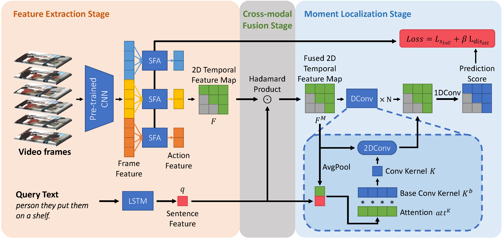
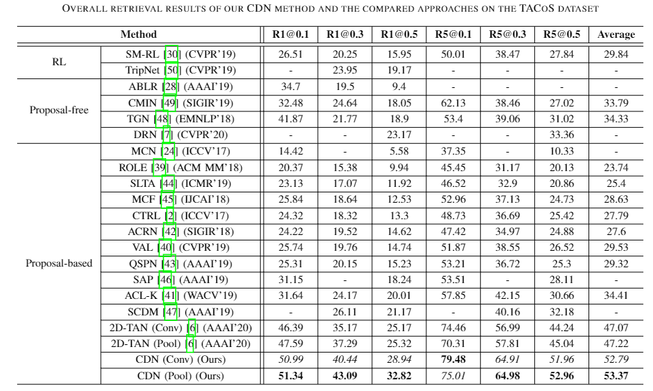
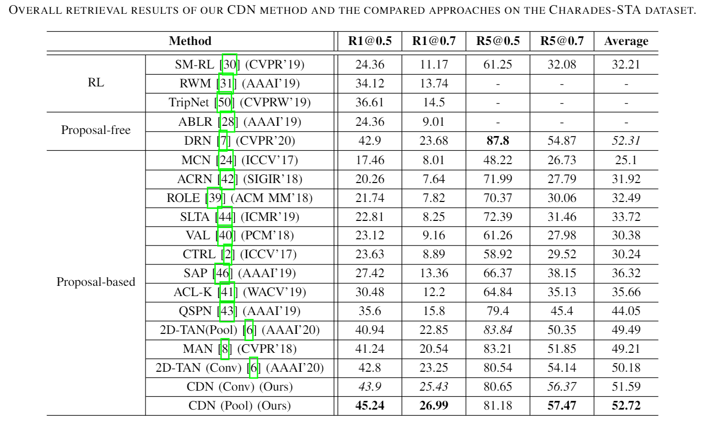

# Cross-modal Dynamic Networks for Video Moment Retrieval with Text Query

## Introduction

This is the implementation code and instruction of the proposed work  *"Cross-modal Dynamic Networks for Video Moment Retrieval with Text Query"* (CDN).

## Environment Requirements

Our code runs based on the following dependencies:
- python3
- torch
- numpy
- tqdm
- h5py
- argparse
- tensorboard
- easydict
- torchtext
- terminaltables
  
## Training 

### Datasets Preparation
The datasets we used for training and evaluation are listed as follow:

- TACoS: https://www.mpi-inf.mpg.de/departments/computer-vision-and-machine-learning/research/vision-and-language/tacos-multi-level-corpus
- Charades-STA: https://prior.allenai.org/projects/charades

### Running
Using the following command to train and evaluate our model.


TACoS
```
python -m torch.distributed.launch --nproc_per_node=2 moment_localization/train.py --gpus 0,1 --cfg experiments\tacos\CDN-128x128-K5L8-pool.yaml --verbose

python -m torch.distributed.launch --nproc_per_node=2 moment_localization/train.py --gpus 0,1 --cfg experiments\tacos\CDN-128x128-K5L8-conv.yaml --verbose
```

Charades-STA 
```
python -m torch.distributed.launch --nproc_per_node=2 moment_localization/train.py --gpus 0,1 --cfg experiments\charades\CDN-16x16-K5L8-pool.yaml --verbose

python -m torch.distributed.launch --nproc_per_node=2 moment_localization/train.py --gpus 0,1 --cfg experiments\charades\CDN-16x16-K5L8-conv.yaml --verbose
```

## Main Idea
we propose a novel model termed Cross-modal Dynamic Networks (CDN) which dynamically generates convolution kernel by visual and language features, as shown in figure below. In the feature extraction stage, we also propose a frame selection module to capture the subtle video information in the video segment. By this approach, the CDN can reduce the impact of the visual noise without significantly increasing the computation cost and leads to superior video moment retrieval result. The experiments on two challenge datasets, i.e., Charades-STA and TACoS, show that our proposed CDN method outperforms a bundle of state-of-the-art methods with more accurately retrieved moment video clips.

<div align="center">

</div>

### Insight of Our Work

1. We propose a novel model termed Cross-modal Dynamic Networks (CDN) for video moment retrieval which fully leverages the information in the text query to reduce the noise in the visual domain with little computational cost during the inference.
2. We design a new sequential frame attention mechanism to extract the features of different actions within a video segment. The extracted features can better reduce the mutual interference noise within a segment.
3. We conduct experiments on two public datasets in a comparable setting. The experimental results show that our proposed CDN method outperforms other state-of-the-art approaches and also demonstrate the advances of the proposed CDN method.

## Overall Results

### Results on TACoS Dataset
<div align="center">

</div>

### Results on Charades-STA Dataset
<div align="center">

</div>

### Visualization of Video Moment Retrieval
<div align="center">

</div>
